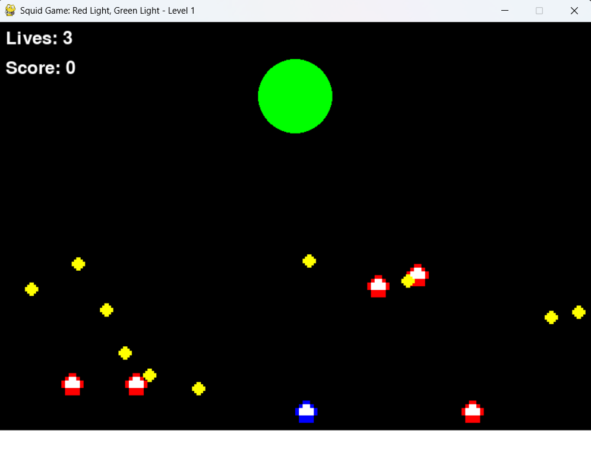

# Squid Game: Red Light, Green Light

  
*Screenshot of the game in action.*

## Overview
This is a Pygame implementation of the **Red Light, Green Light** game from the popular Netflix series *Squid Game*. The player must move when the light is green and stop when it's red, while collecting coins to win. Be careful—moving during the red light will cost you a life!

## Features
- **Pixel Art Graphics**: Retro-style pixel art for characters and objects.
- **Sound Effects**: Immersive sound effects for actions like coin collection and game over.
- **Text-to-Speech**: Voice prompts for "Red Light" and "Green Light."
- **Game States**: Includes main menu, instructions, gameplay, and win/lose screens.
- **Dynamic Difficulty**: Bots move randomly, and the light duration changes unpredictably.

## How to Play
1. **Start the Game**: Run `squid_game.py` using Python 3.
2. **Controls**:
   - **Left Arrow**: Move left.
   - **Right Arrow**: Move right.
   - **Space**: Jump.
3. **Objective**: Collect 10 coins to win. Avoid moving during the red light to preserve your lives.

